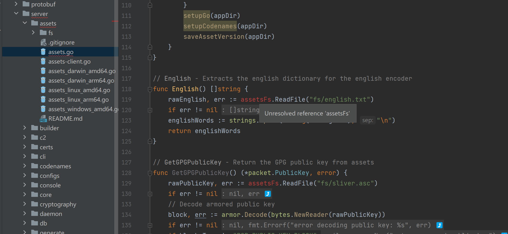
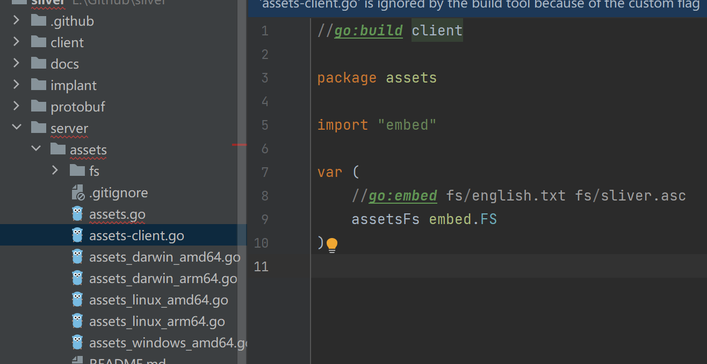
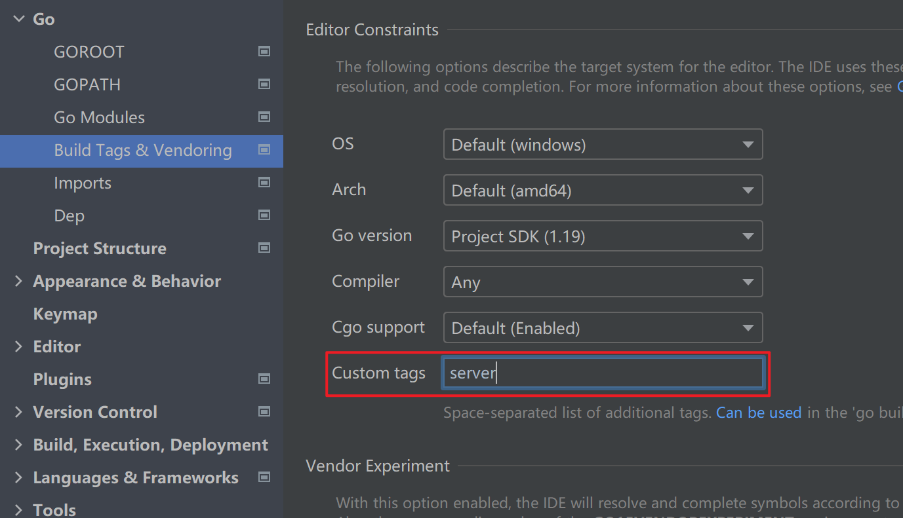

# 架构

```
             In         ┌───────────────┐ C2
┌─────────┐  Memory     │               │ Protocol ┌─────────┐
│ Server  ├────────────►│ Sliver Server ├─────────►│ Implant │
│ Console │             │               │          └─────────┘
└─────────┘             └───────────────┘
                               ▲
                               │
                               │gRPC/mTLS
                               │
                          ┌────┴────┐
                          │ Sliver  │
                          │ Client  │
                          └─────────┘
```

# 目录结构

```
├── client
│   ├── assets 对资源文件的管理
│   ├── cli CLI的实现
│   ├── command Client命令的具体实现
│   ├── console 命令行入口
│   ├── constants 共用的常量
│   ├── core 核心实现
│   ├── licenses
│   ├── overlord Chrome等的后渗透 ToolKit
│   ├── prelude 
│   ├── spin
│   ├── tcpproxy TCP代理
│   ├── transport MTLS
│   └── version 
├── implant
│   ├── scripts vendor升级脚本
│   ├── sliver Implant的所有代码
│   └── vendor
├── protobuf 传输协议的结构定义与具体实现
│   ├── clientpb
│   ├── commonpb
│   ├── dnspb
│   ├── rpcpb
│   └── sliverpb
├── server
│   ├── assets 对资源文件的管理
│   ├── builder Implant生成
│   ├── c2 server侧协议相关 mTLS Http(s) DNS
│   ├── certs 证书生成和管理
│   ├── cli   Sliver server控制台
│   ├── codenames -------生成随机名字，作用暂不确定
│   ├── configs 读取、初始化配置文件
│   ├── console   Server控制台
│   ├── core Server状态相关
│   ├── cryptography 加解密相关
│   ├── daemon 守护进程
│   ├── db GORM的实现
│   ├── generate 二进制生成
│   ├── gogo Go编译工具链
│   ├── handlers 供implant直接请求的API
│   ├── log 日志记录
│   ├── loot 
│   ├── msf msf的封装
│   ├── netstack 网络层处理
│   ├── rpc RPC API 包含了Server的绝大部分功能逻辑
│   ├── sgn SGN shellcode混淆
│   ├── transport 与Client交互的Server功能逻辑
│   ├── watchtower //定期扫描VT等平台，寻找Implant的Hash
│   └── website //管理静态资源 模仿正常网站
├── util
│   ├── encoders 加解密库
│   └── leaky 内存池
```

# Tips

1. 初始打开项目时，会找不到定义

   

   这是由于定义所在的文件，存在条件编译，需要设置标签才可以

   

   在 Goland 中，可以在项目设置中设置

   

2. embed 将文件打包进二进制文件当中，也可以直接进行读取

   ```
   import "embed"
   
   var (
   	//go:embed fs/sliver.asc fs/*.txt fs/*.zip fs/darwin/amd64/*
   	assetsFs embed.FS
   )
   ```

3. 


