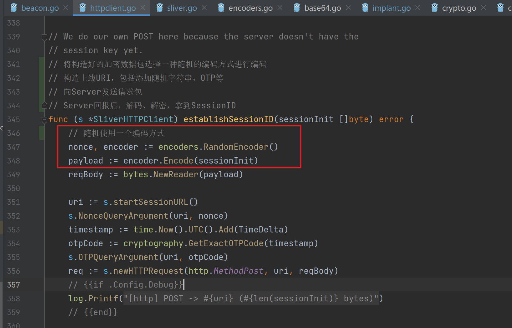
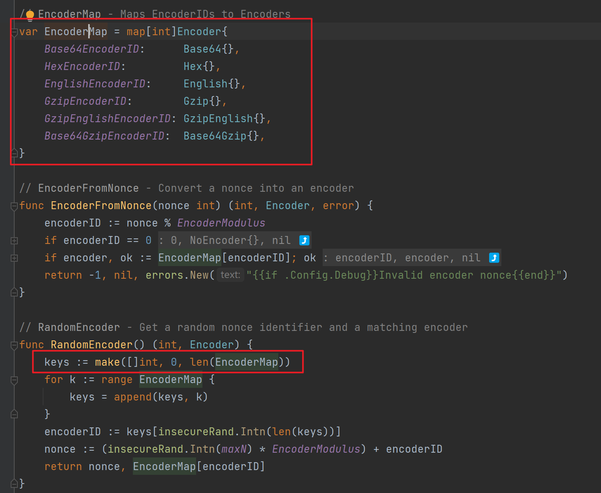
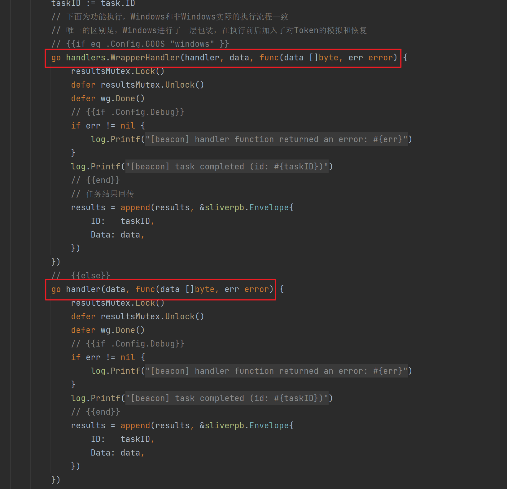
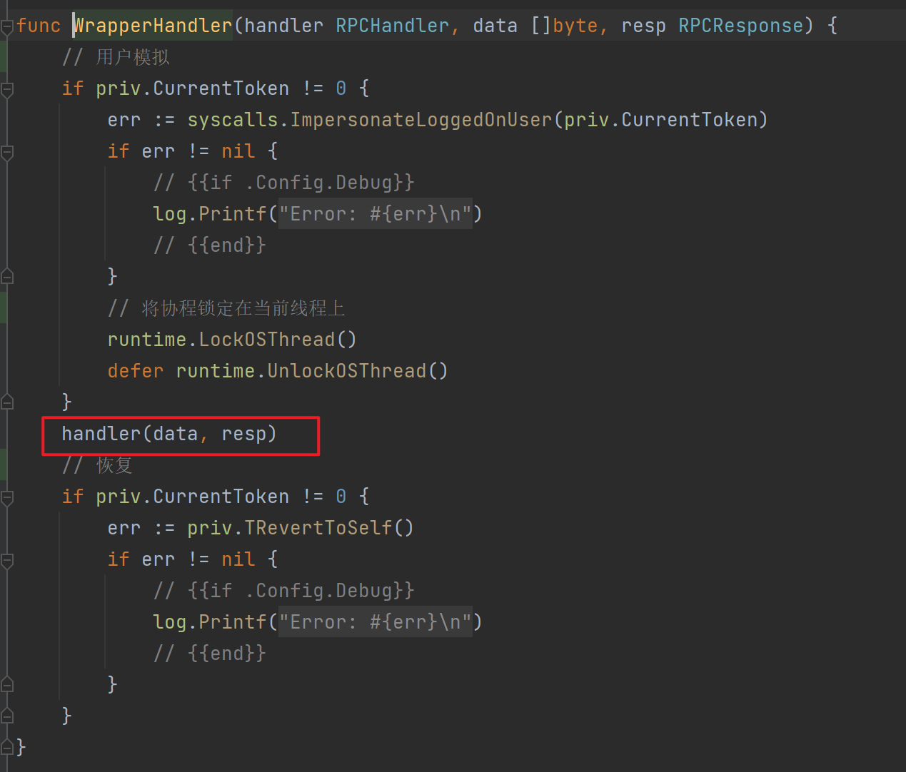
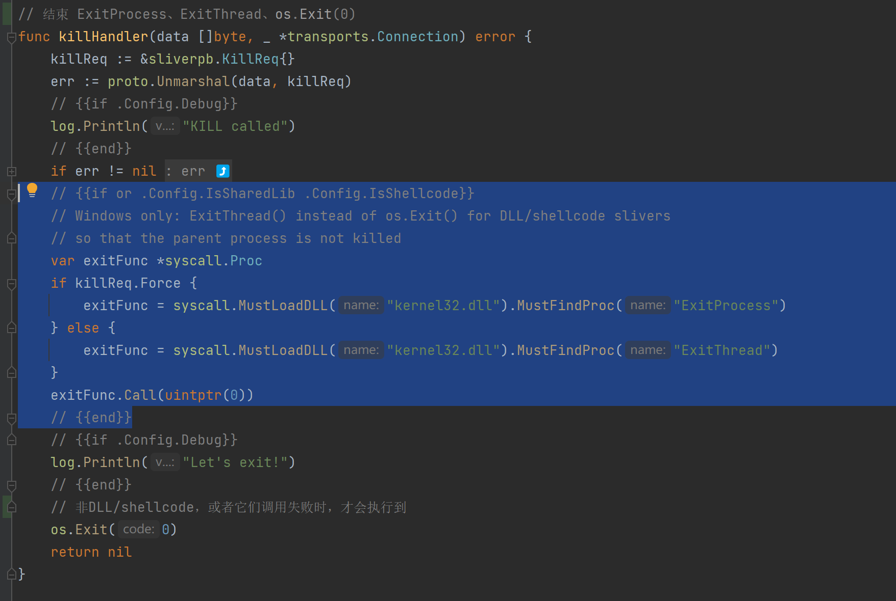
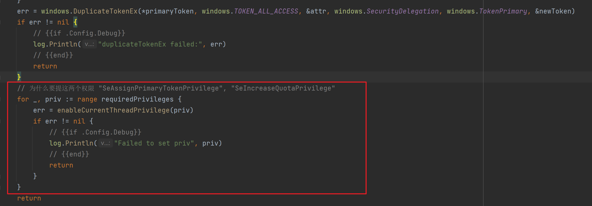

# 架构

```
             In         ┌───────────────┐ C2
┌─────────┐  Memory     │               │ Protocol ┌─────────┐
│ Server  ├────────────►│ Sliver Server ├─────────►│ Implant │
│ Console │             │               │          └─────────┘
└─────────┘             └───────────────┘
                               ▲
                               │
                               │gRPC/mTLS
                               │
                          ┌────┴────┐
                          │ Sliver  │
                          │ Client  │
                          └─────────┘
```

# 目录结构

```
├── client
│   ├── assets 对资源文件的管理
│   ├── cli CLI的实现
│   ├── command Client命令的具体实现
│   ├── console 命令行入口
│   ├── constants 共用的常量
│   ├── core 核心实现
│   ├── licenses
│   ├── overlord Chrome等的后渗透 ToolKit
│   ├── prelude 
│   ├── spin
│   ├── tcpproxy TCP代理
│   ├── transport MTLS
│   └── version 
├── implant
│   ├── scripts vendor升级脚本
│   ├── sliver Implant的所有代码
│   └── vendor
├── protobuf 传输协议的结构定义与具体实现
│   ├── clientpb
│   ├── commonpb
│   ├── dnspb
│   ├── rpcpb
│   └── sliverpb
├── server
│   ├── assets 对资源文件的管理
│   ├── builder Implant生成
│   ├── c2 server侧协议相关 mTLS Http(s) DNS
│   ├── certs 证书生成和管理
│   ├── cli   Sliver server控制台
│   ├── codenames -------生成随机名字，作用暂不确定
│   ├── configs 读取、初始化配置文件
│   ├── console   Server控制台
│   ├── core Server状态相关
│   ├── cryptography 加解密相关
│   ├── daemon 守护进程
│   ├── db GORM的实现
│   ├── generate 二进制生成
│   ├── gogo Go编译工具链
│   ├── handlers 供implant直接请求的API
│   ├── log 日志记录
│   ├── loot 
│   ├── msf msf的封装
│   ├── netstack 网络层处理
│   ├── rpc RPC API 包含了Server的绝大部分功能逻辑
│   ├── sgn SGN shellcode混淆
│   ├── transport 与Client交互的Server功能逻辑
│   ├── watchtower //定期扫描VT等平台，寻找Implant的Hash
│   └── website //管理静态资源 模仿正常网站
├── util
│   ├── encoders 加解密库
│   └── leaky 内存池
```

# Tips

1. 初始打开项目时，会找不到定义

   

   这是由于定义所在的文件，存在条件编译，需要设置标签才可以

   

   在 Goland 中，可以在项目设置中设置

   

2. embed 将文件打包进二进制文件当中，也可以直接进行读取

   ```
   import "embed"
   
   var (
   	//go:embed fs/sliver.asc fs/*.txt fs/*.zip fs/darwin/amd64/*
   	assetsFs embed.FS
   )
   ```

3. 上线前的多种限制条件，通过机器名、用户名等，对于时间的限制，确实比较惊艳

   保证在时间结束后，即使直接被上传 VT 等，也无法让其正常运行

   ```
   expiresAt, err := time.Parse(time.RFC3339, "{{.Config.LimitDatetime}}")
   if err == nil && time.Now().After(expiresAt) {
   	os.Exit(1)
   }
   ```

4. 通过 channel 跨越多层函数调用，并确保其结束

   ```
   abort := make(chan struct{})
   defer func() {
   	abort <- struct{}{}
   }()
   beacons := transports.StartBeaconLoop(abort)
   
   
   
   func StartBeaconLoop(abort <-chan struct{}) <-chan *Beacon {
   	var beacon *Beacon
   	nextBeacon := make(chan *Beacon)
   	c2Generator := C2Generator(innerAbort)
   
   	go func() {
   		defer close(nextBeacon)
   
   // 功能代码
   
   		select {
   		case nextBeacon <- beacon:
   		case <-abort:
   			return
   		}
   	}()
   
   	return nextBeacon
   }
   ```

5. 在发送信息时，不单单用加密进行处理，还进行了编码操作，随机选择一种编码器进行编码，更增加了其随机性

   

   

6. 对于系统版本的判断，有考虑到 Wow64 的情况
   ```
      var arch string
      if runtime.GOARCH == "amd64" {
      	arch = "x86_64"
      } else {
      	var is64Bit bool
      	pHandle, _ := windows.GetCurrentProcess()
      	if uint(pHandle) == 0 {
      		arch = "<error getting arch>"
      	}
      	if err := windows.IsWow64Process(pHandle, &is64Bit); err != nil {
      		arch = "<error getting arch>"
      	} else {
      		if !is64Bit {
      			arch = "x86"
      		} else {
      			arch = "x86_64"
      		}
      	}
      }
   ```

7. 对于 Windows 的功能执行，需要考虑一点的就是 Token，在功能执行前需要进行 Token 模拟，结束之后需要进行恢复，这里做了一层封装，在不影响后续功能执行的情况下，完美的解决了这个问题

   

   

8. 在 Kill 当中提供了三种退出的方式

   在 Windows 中，提供了 ExitProcess、ExitThread 两个方法，如果 call 成功后，当前就会退出了，不会继续向后执行 os.Exit(0) 

   而在非 Windows 当中，则会直接执行 os.Exit(0) 

   

9. 


# Question

1. 在请求时，还增加了 OTP 相关的验证，对于时效性有了一定的要求，对于 Server 端是如何进行配合的，还需要去了解

2. `sliverpb.BeaconRegister` 中有一个 UUID，其中的主机信息中也有一个 UUID，它们的区别和用途暂不清楚

3. 在模拟 Token 的时候为什么要在复制完之后提升这两个权限

   

4. 


